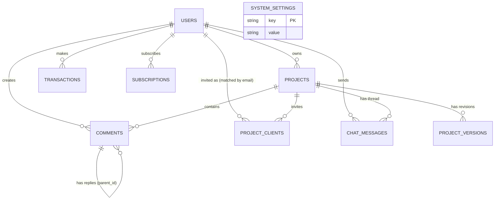

# 🗄️ Database Schema Documentation
**Project:** SaaS Web 3D Architecture Presentation & Feedback Platform
**Database Engine:** PostgreSQL
**Primary Key Standard:** UUID (`uuid_generate_v4()`)
**Reference:** PRD v2.4, RTCF, and RISE Framework
**Revision:** v2.4 — synced with AI_INSTRUCTIONS.md, PRD.md, PROGRESS_TRACKER.md, FOLDER_STRUCTURE.md
**v2.4 Changelog:** Menambahkan tabel `project_clients` (Client Invitation by Email, menggantikan model share-link publik) dan `chat_messages` (In-App Real-time Chat Arsitek-Klien). Klarifikasi bahwa `users` TIDAK memiliki kolom `role` — Arsitek adalah kapabilitas default akun, Klien adalah status per-project via `project_clients`.

---

## 1. Entity Relationship Diagram (ERD) Overview

---

## 2. Detailed Table Schemas

### A. Auth & Core Domain

#### `users`
Menyimpan data pengguna beserta status langganan dan autentikasi Google OAuth. **Tidak ada kolom `role`** — setiap akun otomatis punya kapabilitas Arsitek (boleh membuat project sendiri); status "Klien" bersifat per-project dan didapat lewat kecocokan email pada tabel `project_clients` (bukan atribut pada `users`). Satu akun bisa merangkap Arsitek dan Klien secara bersamaan. Role eksplisit via `spatie/laravel-permission` hanya dipakai untuk `super_admin`, yang tidak pernah bisa didapat lewat registrasi publik.

| Field | Type | Modifiers | Description |
| :--- | :--- | :--- | :--- |
| `id` | `uuid` | `PRIMARY KEY` | Unique Identifier |
| `name` | `string` | `NOT NULL` | Nama lengkap pengguna |
| `email` | `string` | `UNIQUE, NOT NULL` | Alamat email pengguna — dipakai sebagai kunci pencocokan undangan `project_clients` |
| `password` | `string` | `NULLABLE` | Hashed password (null jika login via Google) |
| `google_id` | `string` | `UNIQUE, NULLABLE` | ID unik dari Google OAuth |
| `avatar` | `string` | `NULLABLE` | URL foto profil pengguna |
| `subscription_status` | `string` | `DEFAULT('free')` | Status langganan cache/denormalized: `free`, `pro` (sumber kebenaran ada di tabel `subscriptions`) |
| `email_verified_at` | `timestamp` | `NULLABLE` | Waktu verifikasi email |
| `remember_token` | `string` | `NULLABLE` | Token remember me |
| `created_at` | `timestamp` | `NULLABLE` | Waktu entri dibuat |
| `updated_at` | `timestamp` | `NULLABLE` | Waktu entri diperbarui |

> **Catatan Sinkronisasi:** `subscription_status` pada `users` bersifat *denormalized cache* agar query middleware cepat tanpa join. Status ini WAJIB di-update setiap kali ada perubahan pada tabel `subscriptions` (lihat Domain Billing).

---

### B. Admin Domain

#### `system_settings`
Menyimpan konfigurasi kuota dan aturan bisnis sistem secara dinamis yang dapat diubah oleh Super Admin tanpa re-deploy.

| Field | Type | Modifiers | Description |
| :--- | :--- | :--- | :--- |
| `id` | `uuid` | `PRIMARY KEY` | Unique Identifier |
| `key` | `string` | `UNIQUE, NOT NULL` | Key konfigurasi (contoh: `free_tier_max_projects`) |
| `value` | `string` | `NOT NULL` | Nilai konfigurasi (contoh: `2`) |
| `type` | `string` | `DEFAULT('string')` | Tipe data value: `integer`, `boolean`, `string` |
| `description` | `text` | `NULLABLE` | Penjelasan fungsi konfigurasi |
| `created_at` | `timestamp` | `NULLABLE` | Waktu entri dibuat |
| `updated_at` | `timestamp` | `NULLABLE` | Waktu entri diperbarui |

---

### C. Project Domain

#### `projects`
Menyimpan metadata file 3D `.glb` yang diunggah oleh Arsitek beserta token akses privat untuk klien, serta kuota revisi client per project.

| Field | Type | Modifiers | Description |
| :--- | :--- | :--- | :--- |
| `id` | `uuid` | `PRIMARY KEY` | Unique Identifier |
| `user_id` | `uuid` | `FOREIGN KEY, NOT NULL` | Relasi ke `users.id` (Owner/Arsitek Project) |
| `title` | `string` | `NOT NULL` | Judul project presentasi |
| `slug` | `string` | `UNIQUE, NOT NULL` | Slug URL friendly |
| `description` | `text` | `NULLABLE` | Catatan/deskripsi tambahan |
| `file_path` | `string` | `NOT NULL` | Path lokasi file `.glb` di Storage (Local/R2) |
| `file_size_bytes` | `bigInteger` | `NOT NULL` | Ukuran file dalam bytes |
| `is_draco_compressed` | `boolean` | `DEFAULT(false)` | Status apakah file sudah dikompresi Draco |
| `share_token` | `string` | `UNIQUE, NOT NULL` | **[v2.4] Bukan lagi link publik read-only.** Token dipakai sebagai bagian URL undangan privat (`/p/{share_token}`) yang dikirim via email oleh `InviteClientAction`; membuka URL ini tetap WAJIB login & lolos validasi email di `project_clients` sebelum konten apa pun ditampilkan |
| `max_revisions_allowed` | `integer` | `NOT NULL, DEFAULT(3)` | Batas maksimum revisi client untuk project ini. Default diambil dari `free_tier_default_client_revisions` saat project dibuat, dapat di-override arsitek |
| `current_revision_count` | `integer` | `NOT NULL, DEFAULT(0)` | Jumlah revisi yang sudah terpakai (increment setiap client menambah pin komentar baru / setiap arsitek upload versi baru — lihat aturan bisnis di `AI_INSTRUCTIONS.md` Section F) |
| `created_at` | `timestamp` | `NULLABLE` | Waktu entri dibuat |
| `updated_at` | `timestamp` | `NULLABLE` | Waktu entri diperbarui |

---

#### `project_versions`
Menyimpan riwayat versi/revisi file 3D `.glb` untuk setiap project beserta metadata kompresi dan catatan perubahan.

| Field | Type | Modifiers | Description |
| :--- | :--- | :--- | :--- |
| `id` | `uuid` | `PRIMARY KEY` | Unique Identifier |
| `project_id` | `uuid` | `FOREIGN KEY, NOT NULL` | Relasi ke `projects.id` |
| `version_number` | `integer` | `NOT NULL` | Nomor urut revisi (misal: 1, 2, 3) |
| `file_path` | `string` | `NOT NULL` | Path lokasi file `.glb` versi ini di Storage |
| `file_size_bytes` | `bigInteger` | `NOT NULL` | Ukuran file dalam bytes |
| `changelog` | `text` | `NULLABLE` | Catatan revisi dari pengguna/arsitek |
| `is_draco_compressed` | `boolean` | `DEFAULT(false)` | Status kompresi Draco untuk versi ini |
| `created_at` | `timestamp` | `NULLABLE` | Waktu revisi diunggah |
| `updated_at` | `timestamp` | `NULLABLE` | Waktu entri diperbarui |

---

#### `project_clients` 🆕 [v2.4]
Menyimpan daftar email Klien yang diundang Arsitek ke sebuah project (Client Invitation), beserta status penerimaan undangan. Ini adalah **satu-satunya sumber kebenaran** untuk menentukan apakah sebuah akun berhak membuka project tertentu sebagai Klien — menggantikan model share-link publik lama.

| Field | Type | Modifiers | Description |
| :--- | :--- | :--- | :--- |
| `id` | `uuid` | `PRIMARY KEY` | Unique Identifier |
| `project_id` | `uuid` | `FOREIGN KEY, NOT NULL` | Relasi ke `projects.id` |
| `email` | `string` | `NOT NULL` | Alamat email Klien yang diundang oleh Arsitek |
| `user_id` | `uuid` | `FOREIGN KEY, NULLABLE` | Relasi ke `users.id`; diisi otomatis saat email login user cocok dengan undangan ini (null selagi status `pending` dan user belum pernah login dengan email tsb) |
| `invited_by` | `uuid` | `FOREIGN KEY, NOT NULL` | Relasi ke `users.id` (Arsitek yang mengirim undangan) |
| `status` | `string` | `DEFAULT('pending')` | Status undangan: `pending`, `accepted`, `revoked` |
| `invited_at` | `timestamp` | `NOT NULL` | Waktu undangan dibuat/dikirim |
| `accepted_at` | `timestamp` | `NULLABLE` | Waktu Klien pertama kali berhasil login & tervalidasi emailnya untuk project ini |
| `created_at` | `timestamp` | `NULLABLE` | Waktu entri dibuat |
| `updated_at` | `timestamp` | `NULLABLE` | Waktu entri diperbarui |

> **Catatan Sinkronisasi:** Kombinasi `(project_id, email)` bersifat UNIQUE — satu email hanya boleh diundang satu kali per project (re-invite setelah `revoked` dilakukan dengan update baris yang sama, bukan insert baru). Akses 3D Viewer, Pin Comment, dan Chat pada sebuah project HANYA diizinkan jika ada baris di tabel ini dengan `email` = email user yang login DAN `status` != `revoked` (lihat aturan lengkap di `AI_INSTRUCTIONS.md` Section H).

---

### D. Comment Domain (Spatial Pin Annotation)

#### `comments`
Menyimpan feedback komentar dari Klien/Arsitek beserta titik koordinat spasial 3D $(X, Y, Z)$ dan Normal Vector.

| Field | Type | Modifiers | Description |
| :--- | :--- | :--- | :--- |
| `id` | `uuid` | `PRIMARY KEY` | Unique Identifier |
| `project_id` | `uuid` | `FOREIGN KEY, NOT NULL` | Relasi ke `projects.id` |
| `user_id` | `uuid` | `FOREIGN KEY, NOT NULL` | Relasi ke `users.id` (Klien/Arsitek pemberi komentar) |
| `parent_id` | `uuid` | `FOREIGN KEY, NULLABLE` | Relasi ke `comments.id` untuk thread balasan |
| `content` | `text` | `NOT NULL` | Isi pesan feedback |
| `position_x` | `decimal(10,6)` | `NOT NULL` | Koordinat X titik pin di objek 3D |
| `position_y` | `decimal(10,6)` | `NOT NULL` | Koordinat Y titik pin di objek 3D |
| `position_z` | `decimal(10,6)` | `NOT NULL` | Koordinat Z titik pin di objek 3D |
| `normal_x` | `decimal(10,6)` | `NULLABLE` | Arah Vector Normal X permukaan objek |
| `normal_y` | `decimal(10,6)` | `NULLABLE` | Arah Vector Normal Y permukaan objek |
| `normal_z` | `decimal(10,6)` | `NULLABLE` | Arah Vector Normal Z permukaan objek |
| `status` | `string` | `DEFAULT('open')` | Status revisi: `open`, `in_progress`, `resolved` |
| `created_at` | `timestamp` | `NULLABLE` | Waktu entri dibuat |
| `updated_at` | `timestamp` | `NULLABLE` | Waktu entri diperbarui |

> **Catatan Sinkronisasi:** Setiap kali client (bukan reply dari arsitek, dan bukan reply/thread — hanya pin komentar *root* baru) berhasil membuat baris di tabel ini, `Domains/Comment` WAJIB meng-increment `projects.current_revision_count` sesuai aturan Section F pada `AI_INSTRUCTIONS.md`. Insert HANYA diizinkan jika `user_id` adalah Arsitek pemilik project ATAU Klien dengan status `accepted` di `project_clients` untuk project tsb.

---

### E. Chat Domain (Real-time Messaging) 🆕 [v2.4]

#### `chat_messages`
Menyimpan histori pesan chat real-time antara Arsitek dan Klien dalam konteks satu project. Terpisah dari `comments` — chat bersifat percakapan umum tanpa koordinat spasial, sedangkan `comments` adalah pin feedback terikat titik 3D.

| Field | Type | Modifiers | Description |
| :--- | :--- | :--- | :--- |
| `id` | `uuid` | `PRIMARY KEY` | Unique Identifier |
| `project_id` | `uuid` | `FOREIGN KEY, NOT NULL` | Relasi ke `projects.id` — menentukan channel/room chat |
| `sender_id` | `uuid` | `FOREIGN KEY, NOT NULL` | Relasi ke `users.id` (pengirim pesan; Arsitek pemilik project atau Klien berstatus `accepted`) |
| `message` | `text` | `NOT NULL` | Isi pesan chat |
| `read_at` | `timestamp` | `NULLABLE` | Waktu pesan dibaca oleh lawan bicara (untuk read receipt) |
| `created_at` | `timestamp` | `NULLABLE` | Waktu pesan dikirim |
| `updated_at` | `timestamp` | `NULLABLE` | Waktu entri diperbarui |

> **Catatan Sinkronisasi:** Insert ke tabel ini HANYA diizinkan jika `sender_id` adalah Arsitek pemilik `project_id` ATAU Klien dengan `project_clients.status = 'accepted'` untuk project tsb (validasi sama seperti `comments`). Broadcasting event `ChatMessageSent` dikirim ke private channel `project.{project_id}.chat`, dengan channel authorization di `routes/channels.php` mengecek relasi kepemilikan/undangan yang sama. Lihat aturan lengkap di `AI_INSTRUCTIONS.md` Section I.

---

### F. Billing Domain (Midtrans SaaS Integration)

#### `subscriptions`
Menyimpan status langganan Pro milik user secara historis (mendukung riwayat upgrade/downgrade/expiry), terpisah dari log transaksi pembayaran mentah.

| Field | Type | Modifiers | Description |
| :--- | :--- | :--- | :--- |
| `id` | `uuid` | `PRIMARY KEY` | Unique Identifier |
| `user_id` | `uuid` | `FOREIGN KEY, NOT NULL` | Relasi ke `users.id` |
| `transaction_id` | `uuid` | `FOREIGN KEY, NULLABLE` | Relasi ke `transactions.id` yang mengaktifkan subscription ini |
| `plan` | `string` | `NOT NULL, DEFAULT('pro')` | Nama paket langganan |
| `status` | `string` | `DEFAULT('active')` | Status: `active`, `expired`, `cancelled` |
| `started_at` | `timestamp` | `NOT NULL` | Waktu mulai berlaku |
| `expires_at` | `timestamp` | `NULLABLE` | Waktu berakhir (null = belum ditentukan / auto-renew) |
| `created_at` | `timestamp` | `NULLABLE` | Waktu entri dibuat |
| `updated_at` | `timestamp` | `NULLABLE` | Waktu entri diperbarui |

> **Catatan Sinkronisasi:** Saat `Domains/Billing` menerima webhook `settlement` dari Midtrans, Action `HandleWebhookAction` WAJIB: (1) membuat/memperbarui baris di `subscriptions`, dan (2) meng-update `users.subscription_status` menjadi `pro` agar cache tetap konsisten.

#### `transactions`
Menyimpan riwayat pembayaran transaksi upgrade langganan Pro dari Payment Gateway Midtrans.

| Field | Type | Modifiers | Description |
| :--- | :--- | :--- | :--- |
| `id` | `uuid` | `PRIMARY KEY` | Unique Identifier |
| `user_id` | `uuid` | `FOREIGN KEY, NOT NULL` | Relasi ke `users.id` |
| `order_id` | `string` | `UNIQUE, NOT NULL` | ID transaksi unik (contoh: `TRX-20260916-0001`) |
| `amount` | `decimal(12,2)` | `NOT NULL` | Jumlah nominal pembayaran |
| `payment_type` | `string` | `NULLABLE` | Tipe pembayaran: `qris`, `bank_transfer`, dll. |
| `status` | `string` | `DEFAULT('pending')` | Status transaksi: `pending`, `settlement`, `expire`, `cancel` |
| `snap_response` | `json` | `NULLABLE` | Raw log response payload dari Midtrans |
| `paid_at` | `timestamp` | `NULLABLE` | Waktu konfirmasi settlement |
| `created_at` | `timestamp` | `NULLABLE` | Waktu entri dibuat |
| `updated_at` | `timestamp` | `NULLABLE` | Waktu entri diperbarui |

---

## 3. Indexing & Optimization Strategy

1. **`users.google_id` & `users.email`:** Unique Index untuk mempercepat lookup autentikasi OAuth & Login, sekaligus lookup pencocokan email undangan `project_clients`.
2. **`projects.share_token`:** Unique Index untuk query performa tinggi saat Klien membuka link undangan 3D viewer.
3. **`comments.project_id`:** Index B-Tree untuk mempercepat loading seluruh pin komentar pada satu model 3D.
4. **`system_settings.key`:** Unique Index + Caching via Redis (`predis/predis`) untuk meminimalkan query database saat pengecekan kuota.
5. **`project_versions.project_id`:** Index B-Tree untuk mempercepat pengambilan riwayat versi per project.
6. **`subscriptions.user_id`:** Index B-Tree, dikombinasikan dengan `status` untuk query cepat "apakah user ini Pro aktif saat ini".
7. **`project_clients.(project_id, email)`:** 🆕 Composite Unique Index — kunci utama validasi akses Klien; dicek pada hampir setiap request 3D Viewer/Comment/Chat sehingga wajib sangat cepat.
8. **`project_clients.user_id`:** 🆕 Index B-Tree untuk query "semua project di mana saya jadi Klien" (dashboard dual-capacity akun).
9. **`chat_messages.project_id`:** 🆕 Index B-Tree (composite dengan `created_at DESC`) untuk mempercepat pagination histori chat per project/room.
