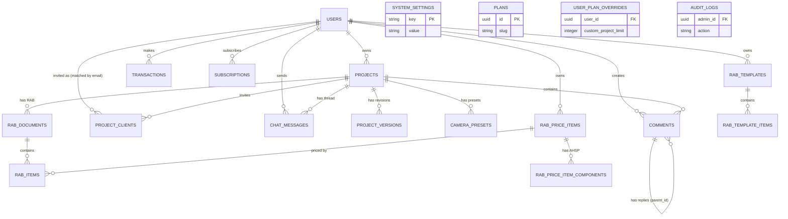

# 🗄️ Database Schema Documentation
**Project:** PitchArch — Platform Presentasi & Feedback Arsitektur 3D
**Database Engine:** MySQL
**Primary Key Standard:** UUID
**Reference:** PRD v2.7, RTCF, RISE Framework
**Revision:** v2.7 — ditambah kolom profil arsitek di `users`, kolom `is_pinned` di `comments`, tabel `rab_price_item_components` (AHSP), kolom `overhead_percent`/`has_components` di `rab_price_items`, tabel wilayah `laravolt/indonesia`, rancangan Drawing 2D
**v2.6 Changelog:** Menambahkan modul RAB (tabel `rab_*`, kolom `plans.can_use_rab`)
**v2.5 Changelog:** Mengganti engine dari PostgreSQL ke **MySQL** (aktual). Menambahkan tabel `camera_presets`. Semua tipe `jsonb` → `json` (MySQL syntax). Menyesuaikan catatan storage dari Cloudflare R2 ke **local disk `public`**.

---

## 1. Entity Relationship Diagram (ERD) Overview

```mermaid
erDiagram
    USERS ||--o{ PROJECTS : "owns"
    USERS ||--o{ COMMENTS : "creates"
    USERS ||--o{ TRANSACTIONS : "makes"
    USERS ||--o{ SUBSCRIPTIONS : "subscribes"
    USERS ||--o{ PROJECT_CLIENTS : "invited as (matched by email)"
    USERS ||--o{ CHAT_MESSAGES : "sends"
    PROJECTS ||--o{ COMMENTS : "contains"
    PROJECTS ||--o{ PROJECT_VERSIONS : "has revisions"
    PROJECTS ||--o{ PROJECT_CLIENTS : "invites"
    PROJECTS ||--o{ CHAT_MESSAGES : "has thread"
    PROJECTS ||--o{ CAMERA_PRESETS : "has presets"
    COMMENTS ||--o{ COMMENTS : "has replies (parent_id)"
    USERS ||--o{ RAB_PRICE_ITEMS : "owns"
    USERS ||--o{ RAB_TEMPLATES : "owns"
    PROJECTS ||--o{ RAB_DOCUMENTS : "has RAB"
    RAB_DOCUMENTS ||--o{ RAB_ITEMS : "contains"
    RAB_TEMPLATES ||--o{ RAB_TEMPLATE_ITEMS : "contains"
    RAB_PRICE_ITEMS ||--o{ RAB_ITEMS : "priced by"
    RAB_PRICE_ITEMS ||--o{ RAB_PRICE_ITEM_COMPONENTS : "has AHSP"
    SYSTEM_SETTINGS {
        string key PK
        string value
    }
    PLANS {
        uuid id PK
        string slug
    }
    USER_PLAN_OVERRIDES {
        uuid user_id FK
        integer custom_project_limit
    }
    AUDIT_LOGS {
        uuid admin_id FK
        string action
    }
```

---

## 2. Detailed Table Schemas

### A. Auth & Core Domain

#### `users`
Menyimpan data pengguna beserta status langganan dan autentikasi Google OAuth. **Tidak ada kolom `role`** — setiap akun otomatis punya kapabilitas Arsitek; status "Klien" bersifat per-project dan didapat lewat kecocokan email pada tabel `project_clients`. Role eksplisit via `spatie/laravel-permission` hanya dipakai untuk `super_admin`.

| Field | Type | Modifiers | Description |
| :--- | :--- | :--- | :--- |
| `id` | `uuid` | `PRIMARY KEY` | Unique Identifier |
| `name` | `string` | `NOT NULL` | Nama lengkap pengguna |
| `email` | `string` | `UNIQUE, NOT NULL` | Alamat email — kunci pencocokan undangan `project_clients` |
| `password` | `string` | `NULLABLE` | Hashed password (null jika login via Google OAuth) |
| `google_id` | `string` | `UNIQUE, NULLABLE` | ID unik dari Google OAuth |
| `avatar` | `string` | `NULLABLE` | URL foto profil pengguna |
| `subscription_status` | `string` | `DEFAULT('free')` | Status langganan cache/denormalized: `free`, `pro` (sumber kebenaran di tabel `subscriptions`) |
| `email_verified_at` | `timestamp` | `NULLABLE` | Waktu verifikasi email; diset otomatis saat registrasi via Google OAuth |
| `two_factor_secret` | `text` | `NULLABLE` | Secret 2FA (Fortify) |
| `two_factor_recovery_codes` | `text` | `NULLABLE` | Recovery codes 2FA (Fortify) |
| `two_factor_confirmed_at` | `timestamp` | `NULLABLE` | Waktu konfirmasi 2FA aktif |
| `remember_token` | `string` | `NULLABLE` | Token remember me |
| `created_at` | `timestamp` | `NULLABLE` | Waktu entri dibuat |
| `updated_at` | `timestamp` | `NULLABLE` | Waktu entri diperbarui |

> **Kolom Profil Arsitek (v2.7):** Kolom-kolom berikut ditambahkan untuk menyimpan data badan usaha dan alamat wilayah Indonesia. Dipakai sebagai kop surat di Export RAB.

| Field | Type | Modifiers | Description |
| :--- | :--- | :--- | :--- |
| `company_type` | `string(30)` | `NULLABLE` | Tipe badan usaha: `perorangan`, `cv`, `pt`, `firma`, dll. |
| `company_name` | `string` | `NULLABLE` | Nama badan usaha / studio |
| `phone` | `string(20)` | `NULLABLE` | Nomor telepon |
| `province_id` | `string` | `NULLABLE` | ID provinsi dari `laravolt/indonesia` |
| `city_id` | `string` | `NULLABLE` | ID kabupaten/kota |
| `district_id` | `string` | `NULLABLE` | ID kecamatan |
| `village_id` | `string` | `NULLABLE` | ID kelurahan/desa |
| `province_name` | `string` | `NULLABLE` | Nama provinsi (denormalized cache) |
| `city_name` | `string` | `NULLABLE` | Nama kota (denormalized cache) |
| `district_name` | `string` | `NULLABLE` | Nama kecamatan (denormalized cache) |
| `village_name` | `string` | `NULLABLE` | Nama kelurahan (denormalized cache) |
| `address` | `text` | `NULLABLE` | Alamat jalan lengkap |
| `postal_code` | `string(10)` | `NULLABLE` | Kode pos |

> **Catatan Sinkronisasi:** `subscription_status` pada `users` bersifat *denormalized cache* agar query middleware cepat tanpa join. Status ini WAJIB di-update setiap kali ada perubahan pada tabel `subscriptions` (lihat Domain Billing). Google OAuth otomatis men-set `email_verified_at` saat `CreateNewUser` (tidak perlu kirim email verifikasi ulang).

---

### B. Admin & Config Domain

#### `system_settings`
Menyimpan konfigurasi kuota dan aturan bisnis sistem secara dinamis yang dapat diubah oleh Super Admin tanpa re-deploy.

| Field | Type | Modifiers | Description |
| :--- | :--- | :--- | :--- |
| `id` | `uuid` | `PRIMARY KEY` | Unique Identifier |
| `key` | `string` | `UNIQUE, NOT NULL` | Key konfigurasi (contoh: `free_tier_max_projects`) |
| `value` | `string` | `NOT NULL` | Nilai konfigurasi (contoh: `1`) |
| `type` | `string` | `DEFAULT('string')` | Tipe data value: `integer`, `boolean`, `string` |
| `description` | `text` | `NULLABLE` | Penjelasan fungsi konfigurasi |
| `created_at` | `timestamp` | `NULLABLE` | Waktu entri dibuat |
| `updated_at` | `timestamp` | `NULLABLE` | Waktu entri diperbarui |

#### `audit_logs`
Menyimpan jejak audit atas seluruh tindakan administratif.

| Field | Type | Modifiers | Description |
| :--- | :--- | :--- | :--- |
| `id` | `uuid` | `PRIMARY KEY` | Unique Identifier |
| `admin_id` | `uuid` | `FOREIGN KEY, NOT NULL` | Relasi ke `users.id` (Admin pelaku aksi) |
| `target_user_id` | `uuid` | `FOREIGN KEY, NULLABLE` | Relasi ke `users.id` (User terdampak) |
| `action` | `string` | `NOT NULL` | Jenis aksi (cth: `user.subscription.change`, `user.limit.override`) |
| `old_value` | `json` | `NULLABLE` | Payload nilai sebelum perubahan |
| `new_value` | `json` | `NULLABLE` | Payload nilai setelah perubahan |
| `ip_address` | `string` | `NULLABLE` | Alamat IP admin |
| `user_agent` | `text` | `NULLABLE` | User Agent browser admin |
| `metadata` | `json` | `NULLABLE` | Metadata tambahan |
| `created_at` | `timestamp` | `NOT NULL` | Waktu pencatatan log |

---

### C. Project Domain

#### `projects`
Menyimpan metadata file 3D `.glb` yang diunggah oleh Arsitek.

| Field | Type | Modifiers | Description |
| :--- | :--- | :--- | :--- |
| `id` | `uuid` | `PRIMARY KEY` | Unique Identifier |
| `user_id` | `uuid` | `FOREIGN KEY, NOT NULL` | Relasi ke `users.id` (Owner/Arsitek Project) |
| `title` | `string` | `NOT NULL` | Judul project presentasi |
| `slug` | `string` | `UNIQUE, NOT NULL` | Slug URL friendly |
| `description` | `text` | `NULLABLE` | Catatan/deskripsi tambahan |
| `file_path` | `string` | `NOT NULL` | Path lokasi file `.glb` di storage (relative dari `storage/app/public/`) |
| `file_size_bytes` | `bigInteger` | `NOT NULL` | Ukuran file dalam bytes |
| `is_draco_compressed` | `boolean` | `DEFAULT(false)` | Status apakah file sudah dikompresi Draco |
| `share_token` | `string` | `UNIQUE, NOT NULL` | Token URL undangan privat (`/p/{share_token}`) — membuka URL ini tetap WAJIB login & lolos validasi email di `project_clients` |
| `max_revisions_allowed` | `integer` | `NOT NULL, DEFAULT(3)` | Batas maksimum revisi client. Default dari `system_settings`, dapat di-override arsitek |
| `current_revision_count` | `integer` | `NOT NULL, DEFAULT(0)` | Jumlah revisi yang sudah terpakai |
| `created_at` | `timestamp` | `NULLABLE` | Waktu entri dibuat |
| `updated_at` | `timestamp` | `NULLABLE` | Waktu entri diperbarui |

---

#### `project_versions`
Menyimpan riwayat versi/revisi file 3D `.glb` untuk setiap project.

| Field | Type | Modifiers | Description |
| :--- | :--- | :--- | :--- |
| `id` | `uuid` | `PRIMARY KEY` | Unique Identifier |
| `project_id` | `uuid` | `FOREIGN KEY, NOT NULL` | Relasi ke `projects.id` |
| `version_number` | `integer` | `NOT NULL` | Nomor urut revisi (1, 2, 3, ...) |
| `file_path` | `string` | `NOT NULL` | Path lokasi file `.glb` versi ini di storage |
| `file_size_bytes` | `bigInteger` | `NOT NULL` | Ukuran file dalam bytes |
| `changelog` | `text` | `NULLABLE` | Catatan revisi dari arsitek |
| `is_draco_compressed` | `boolean` | `DEFAULT(false)` | Status kompresi Draco untuk versi ini |
| `created_at` | `timestamp` | `NULLABLE` | Waktu revisi diunggah |
| `updated_at` | `timestamp` | `NULLABLE` | Waktu entri diperbarui |

---

#### `project_clients`
Menyimpan daftar email Klien yang diundang Arsitek ke sebuah project. Ini adalah **satu-satunya sumber kebenaran** untuk menentukan apakah sebuah akun berhak membuka project tertentu sebagai Klien.

| Field | Type | Modifiers | Description |
| :--- | :--- | :--- | :--- |
| `id` | `uuid` | `PRIMARY KEY` | Unique Identifier |
| `project_id` | `uuid` | `FOREIGN KEY, NOT NULL` | Relasi ke `projects.id` |
| `email` | `string` | `NOT NULL` | Alamat email Klien yang diundang |
| `user_id` | `uuid` | `FOREIGN KEY, NULLABLE` | Relasi ke `users.id`; diisi saat email login user cocok dengan undangan |
| `invited_by` | `uuid` | `FOREIGN KEY, NOT NULL` | Relasi ke `users.id` (Arsitek yang mengirim undangan) |
| `status` | `string` | `DEFAULT('pending')` | Status undangan: `pending`, `accepted`, `revoked` |
| `invited_at` | `timestamp` | `NOT NULL` | Waktu undangan dibuat/dikirim |
| `accepted_at` | `timestamp` | `NULLABLE` | Waktu Klien pertama kali berhasil login & tervalidasi emailnya |
| `created_at` | `timestamp` | `NULLABLE` | Waktu entri dibuat |
| `updated_at` | `timestamp` | `NULLABLE` | Waktu entri diperbarui |

> **Catatan:** Kombinasi `(project_id, email)` bersifat UNIQUE. Akses 3D Viewer, Pin Comment, dan Chat pada sebuah project HANYA diizinkan jika ada baris dengan `email` = email user yang login DAN `status` = `accepted`.

---

#### `camera_presets`
Menyimpan sudut/angle kamera yang disimpan Arsitek pada project tertentu untuk memudahkan navigasi ke titik pandang penting.

| Field | Type | Modifiers | Description |
| :--- | :--- | :--- | :--- |
| `id` | `uuid` | `PRIMARY KEY` | Unique Identifier |
| `project_id` | `uuid` | `FOREIGN KEY, NOT NULL` | Relasi ke `projects.id` |
| `user_id` | `uuid` | `FOREIGN KEY, NOT NULL` | Relasi ke `users.id` (Arsitek yang menyimpan preset) |
| `name` | `string` | `NOT NULL` | Label preset (cth: "Fasad Depan", "Kamar Utama") |
| `position_x` | `decimal(10,6)` | `NOT NULL` | Posisi kamera X |
| `position_y` | `decimal(10,6)` | `NOT NULL` | Posisi kamera Y |
| `position_z` | `decimal(10,6)` | `NOT NULL` | Posisi kamera Z |
| `target_x` | `decimal(10,6)` | `NOT NULL` | Titik target/look-at kamera X |
| `target_y` | `decimal(10,6)` | `NOT NULL` | Titik target/look-at kamera Y |
| `target_z` | `decimal(10,6)` | `NOT NULL` | Titik target/look-at kamera Z |
| `created_at` | `timestamp` | `NULLABLE` | Waktu entri dibuat |
| `updated_at` | `timestamp` | `NULLABLE` | Waktu entri diperbarui |

---

### D. Comment Domain (Spatial Pin Annotation)

#### `comments`
Menyimpan feedback komentar beserta titik koordinat spasial 3D $(X, Y, Z)$ dan Normal Vector.

| Field | Type | Modifiers | Description |
| :--- | :--- | :--- | :--- |
| `id` | `uuid` | `PRIMARY KEY` | Unique Identifier |
| `project_id` | `uuid` | `FOREIGN KEY, NOT NULL` | Relasi ke `projects.id` |
| `user_id` | `uuid` | `FOREIGN KEY, NOT NULL` | Relasi ke `users.id` (pemberi komentar) |
| `parent_id` | `uuid` | `FOREIGN KEY, NULLABLE` | Relasi ke `comments.id` untuk thread balasan |
| `content` | `text` | `NOT NULL` | Isi pesan feedback |
| `position_x` | `decimal(10,6)` | `NOT NULL` | Koordinat X titik pin di objek 3D |
| `position_y` | `decimal(10,6)` | `NOT NULL` | Koordinat Y titik pin di objek 3D |
| `position_z` | `decimal(10,6)` | `NOT NULL` | Koordinat Z titik pin di objek 3D |
| `normal_x` | `decimal(10,6)` | `NULLABLE` | Arah Vector Normal X permukaan objek |
| `normal_y` | `decimal(10,6)` | `NULLABLE` | Arah Vector Normal Y permukaan objek |
| `normal_z` | `decimal(10,6)` | `NULLABLE` | Arah Vector Normal Z permukaan objek |
| `status` | `string` | `DEFAULT('open')` | Status revisi: `open`, `in_progress`, `resolved` |
| `is_pinned` | `boolean` | `DEFAULT(false)` | Apakah komentar di-pin oleh arsitek |
| `created_at` | `timestamp` | `NULLABLE` | Waktu entri dibuat |
| `updated_at` | `timestamp` | `NULLABLE` | Waktu entri diperbarui |

> **Catatan:** Setiap kali client membuat pin komentar *root baru* (bukan reply, bukan komentar dari arsitek sendiri), `Domains/Comment` WAJIB meng-increment `projects.current_revision_count`.

> **v2.7:** Kolom `is_pinned` sudah ada di skema v2.6. Migration `add_is_pinned_to_comments` telah dijalankan.

---

### E. Chat Domain (Real-time Messaging)

#### `chat_messages`
Menyimpan histori pesan chat real-time antara Arsitek dan Klien dalam konteks satu project. Terpisah dari `comments` — chat adalah percakapan umum tanpa koordinat spasial.

| Field | Type | Modifiers | Description |
| :--- | :--- | :--- | :--- |
| `id` | `uuid` | `PRIMARY KEY` | Unique Identifier |
| `project_id` | `uuid` | `FOREIGN KEY, NOT NULL` | Relasi ke `projects.id` — menentukan channel/room chat |
| `sender_id` | `uuid` | `FOREIGN KEY, NOT NULL` | Relasi ke `users.id` (pengirim; Arsitek pemilik atau Klien `accepted`) |
| `message` | `text` | `NOT NULL` | Isi pesan chat |
| `read_at` | `timestamp` | `NULLABLE` | Waktu pesan dibaca (untuk read receipt — belum diimplementasikan) |
| `created_at` | `timestamp` | `NULLABLE` | Waktu pesan dikirim |
| `updated_at` | `timestamp` | `NULLABLE` | Waktu entri diperbarui |

> **Catatan:** Insert HANYA diizinkan jika `sender_id` adalah Arsitek pemilik `project_id` ATAU Klien dengan `project_clients.status = 'accepted'`. Broadcasting event `ChatMessageSent` ke private channel `project.{project_id}.chat`. Chat TIDAK meng-increment `current_revision_count`.

---

### F. Billing Domain (Midtrans SaaS Integration)

#### `plans`
Menyimpan konfigurasi paket langganan secara dinamis.

| Field | Type | Modifiers | Description |
| :--- | :--- | :--- | :--- |
| `id` | `uuid` | `PRIMARY KEY` | Unique Identifier |
| `name` | `string` | `NOT NULL` | Nama paket (Free, Pro, Enterprise) |
| `slug` | `string` | `UNIQUE, NOT NULL` | Slug paket (`free`, `pro`, `enterprise`) |
| `description` | `text` | `NULLABLE` | Deskripsi paket |
| `project_limit` | `integer` | `NULLABLE` | Batas project (`null` = Unlimited) |
| `can_create_project` | `boolean` | `DEFAULT(true)` | Izin membuat project |
| `can_edit_project` | `boolean` | `DEFAULT(true)` | Izin mengedit project |
| `can_delete_project` | `boolean` | `DEFAULT(true)` | Izin menghapus project |
| `can_export` | `boolean` | `DEFAULT(false)` | Akses fitur export |
| `max_team_members` | `integer` | `DEFAULT(1)` | Batas anggota tim |
| `api_access` | `boolean` | `DEFAULT(false)` | Akses REST API |
| `audit_log` | `boolean` | `DEFAULT(false)` | Akses log audit |
| `advanced_analytics` | `boolean` | `DEFAULT(false)` | Akses analitik tingkat lanjut |
| `sso` | `boolean` | `DEFAULT(false)` | Akses Single Sign-On |
| `custom_branding` | `boolean` | `DEFAULT(false)` | Fitur custom branding |
| `priority_support` | `boolean` | `DEFAULT(false)` | Akses priority support |
| `can_use_rab` | `boolean` | `DEFAULT(false)` | Akses modul RAB & Lembar Kerja (true untuk Pro & Enterprise) |
| `status` | `string` | `DEFAULT('active')` | Status paket: `active`, `inactive` |
| `created_at` | `timestamp` | `NULLABLE` | Waktu entri dibuat |
| `updated_at` | `timestamp` | `NULLABLE` | Waktu entri diperbarui |

#### `user_plan_overrides`
Menyimpan override batasan project individual per user yang diatur oleh Admin.

| Field | Type | Modifiers | Description |
| :--- | :--- | :--- | :--- |
| `id` | `uuid` | `PRIMARY KEY` | Unique Identifier |
| `user_id` | `uuid` | `FOREIGN KEY, UNIQUE, NOT NULL` | Relasi ke `users.id` |
| `custom_project_limit` | `integer` | `NULLABLE` | Nilai batas kuota kustom |
| `is_unlimited` | `boolean` | `DEFAULT(false)` | Flag eksplisit jika limit di-override menjadi unlimited |
| `reason` | `string` | `NULLABLE` | Alasan pemberian limit kustom |
| `created_at` | `timestamp` | `NULLABLE` | Waktu entri dibuat |
| `updated_at` | `timestamp` | `NULLABLE` | Waktu entri diperbarui |

#### `subscriptions`
Menyimpan status langganan Pro milik user secara historis.

| Field | Type | Modifiers | Description |
| :--- | :--- | :--- | :--- |
| `id` | `uuid` | `PRIMARY KEY` | Unique Identifier |
| `user_id` | `uuid` | `FOREIGN KEY, NOT NULL` | Relasi ke `users.id` |
| `transaction_id` | `uuid` | `FOREIGN KEY, NULLABLE` | Relasi ke `transactions.id` yang mengaktifkan subscription ini |
| `plan` | `string` | `NOT NULL, DEFAULT('pro')` | Nama paket langganan |
| `status` | `string` | `DEFAULT('active')` | Status: `active`, `expired`, `cancelled` |
| `started_at` | `timestamp` | `NOT NULL` | Waktu mulai berlaku |
| `expires_at` | `timestamp` | `NULLABLE` | Waktu berakhir (null = belum ditentukan) |
| `created_at` | `timestamp` | `NULLABLE` | Waktu entri dibuat |
| `updated_at` | `timestamp` | `NULLABLE` | Waktu entri diperbarui |

> **Catatan:** Saat Midtrans webhook `settlement` diterima, `HandleWebhookAction` WAJIB update `subscriptions` DAN `users.subscription_status` secara atomik (dual-write dalam satu DB transaction).

#### `transactions`
Menyimpan riwayat pembayaran transaksi upgrade langganan dari Midtrans.

| Field | Type | Modifiers | Description |
| :--- | :--- | :--- | :--- |
| `id` | `uuid` | `PRIMARY KEY` | Unique Identifier |
| `user_id` | `uuid` | `FOREIGN KEY, NOT NULL` | Relasi ke `users.id` |
| `order_id` | `string` | `UNIQUE, NOT NULL` | ID transaksi unik (format: `TRX-YYYYMMDD-XXXX`) |
| `amount` | `decimal(12,2)` | `NOT NULL` | Jumlah nominal pembayaran |
| `payment_type` | `string` | `NULLABLE` | Tipe pembayaran: `qris`, `bank_transfer`, dll. |
| `status` | `string` | `DEFAULT('pending')` | Status: `pending`, `settlement`, `expire`, `cancel` |
| `snap_response` | `json` | `NULLABLE` | Raw log response payload dari Midtrans |
| `paid_at` | `timestamp` | `NULLABLE` | Waktu konfirmasi settlement |
| `created_at` | `timestamp` | `NULLABLE` | Waktu entri dibuat |
| `updated_at` | `timestamp` | `NULLABLE` | Waktu entri diperbarui |

---

### G. Rab Domain (RAB & Lembar Kerja)

#### `rab_price_items`
Harga satuan master milik user.

| Field | Type | Modifiers | Description |
| :--- | :--- | :--- | :--- |
| `id` | `uuid` | `PRIMARY KEY` | Unique Identifier |
| `user_id` | `uuid` | `FOREIGN KEY, NOT NULL` | Pemilik |
| `code` | `string(50)` | `NULLABLE` | Kode item; UNIQUE bersama `user_id` |
| `name` | `string` | `NOT NULL` | Nama pekerjaan/material |
| `unit` | `string(20)` | `NOT NULL` | m², m³, unit, m', ls |
| `unit_price` | `decimal(14,2)` | `DEFAULT(0)` | Harga satuan (dikalkulasi dari komponen AHSP jika `has_components = true`) |
| `overhead_percent` | `decimal(5,2)` | `DEFAULT(0)` | Persentase overhead/profit (dipakai saat `has_components = true`) |
| `has_components` | `boolean` | `DEFAULT(false)` | True jika `unit_price` dikalkulasi dari `rab_price_item_components` |
| `category` | `string(100)` | `NULLABLE` | Kategori pekerjaan |
| `created_at` / `updated_at` | `timestamp` | `NULLABLE` | |

#### `rab_price_item_components` *(AHSP — Analisa Harga Satuan Pekerjaan)*
Sub-komponen biaya dari sebuah harga satuan. Hanya ada jika `rab_price_items.has_components = true`.

| Field | Type | Modifiers | Description |
| :--- | :--- | :--- | :--- |
| `id` | `uuid` | `PRIMARY KEY` | Unique Identifier |
| `rab_price_item_id` | `uuid` | `FOREIGN KEY, NOT NULL, CASCADE` | Relasi ke `rab_price_items.id` |
| `type` | `string(20)` | `NOT NULL` | Tipe komponen: `tenaga`, `bahan`, `peralatan` |
| `name` | `string` | `NOT NULL` | Nama komponen (cth: "Tukang Batu", "Semen Portland") |
| `unit` | `string(20)` | `NOT NULL` | Satuan komponen |
| `coefficient` | `decimal(14,6)` | `DEFAULT(0)` | Koefisien/indeks kebutuhan per satuan pekerjaan |
| `unit_price` | `decimal(14,2)` | `DEFAULT(0)` | Harga satuan komponen |
| `amount` | `decimal(16,2)` | `DEFAULT(0)` | Hasil hitung: `coefficient × unit_price` |
| `sort_order` | `unsignedInteger` | `DEFAULT(0)` | Urutan tampil |
| `created_at` / `updated_at` | `timestamp` | `NULLABLE` | |

> **Catatan AHSP:** `RecalculatePriceItemAction` adalah satu sumber kebenaran untuk menghitung `amount` setiap komponen dan `rab_price_items.unit_price` dari penjumlahan semua `amount` + `overhead_percent`. Dilarang menghitung di controller atau frontend sebagai nilai tersimpan.

#### `rab_templates` & `rab_template_items`
- `rab_templates`: `id`, `user_id` (FK), `name`, `description` (nullable), timestamps.
- `rab_template_items`: `id`, `rab_template_id` (FK, cascade), `rab_price_item_id` (FK, cascade), `section` (default `Umum`), `sort_order`, timestamps.

#### `rab_mappings`
Aturan pencocokan nama objek/material/baris CSV ke harga satuan (dipakai Fase B & C).

| Field | Type | Modifiers | Description |
| :--- | :--- | :--- | :--- |
| `id` | `uuid` | `PRIMARY KEY` | |
| `user_id` | `uuid` | `FOREIGN KEY, NOT NULL` | |
| `match_type` | `string(20)` | `DEFAULT('name_pattern')` | `name_pattern`, `material`, `exact` |
| `pattern` | `string` | `NOT NULL` | Contoh `DINDING_BATA_*`; UNIQUE `(user_id, match_type, pattern)` |
| `rab_price_item_id` | `uuid` | `FOREIGN KEY, NOT NULL` | Harga satuan tujuan |
| `quantity_basis` | `string(20)` | `DEFAULT('area')` | `area`, `volume`, `count`, `length` |
| timestamps | | | |

#### `rab_documents`
| Field | Type | Modifiers | Description |
| :--- | :--- | :--- | :--- |
| `id` | `uuid` | `PRIMARY KEY` | |
| `project_id` | `uuid` | `FOREIGN KEY, NOT NULL` | Relasi ke `projects.id` |
| `project_version_id` | `uuid` | `FOREIGN KEY, NULLABLE` | Versi `.glb` yang dihitung |
| `user_id` | `uuid` | `FOREIGN KEY, NOT NULL` | Pembuat (Arsitek pemilik) |
| `rab_template_id` | `uuid` | `FOREIGN KEY, NULLABLE` | Template asal |
| `title` | `string` | `NOT NULL` | |
| `source` | `string(10)` | `DEFAULT('manual')` | `manual`, `csv`, `glb` |
| `status` | `string(10)` | `DEFAULT('draft')` | `draft`, `final` |
| `is_visible_to_clients` | `boolean` | `DEFAULT(false)` | Switch: Klien `accepted` boleh melihat read-only |
| `overhead_percent` / `ppn_percent` | `decimal(5,2)` | `DEFAULT(0)` | |
| `subtotal` / `overhead_amount` / `ppn_amount` / `total` | `decimal(16,2)` | `DEFAULT(0)` | Hasil hitung |
| `finalized_at` | `timestamp` | `NULLABLE` | |
| timestamps | | | |

#### `rab_items`
| Field | Type | Modifiers | Description |
| :--- | :--- | :--- | :--- |
| `id` | `uuid` | `PRIMARY KEY` | |
| `rab_document_id` | `uuid` | `FOREIGN KEY, NOT NULL` | |
| `rab_price_item_id` | `uuid` | `FOREIGN KEY, NULLABLE` | Null jika belum dipetakan / harga manual |
| `section` | `string` | `DEFAULT('Umum')` | Bagian pekerjaan |
| `description` | `string` | `NOT NULL` | |
| `unit` | `string(20)` | `NOT NULL` | |
| `quantity` | `decimal(14,3)` | `DEFAULT(0)` | |
| `waste_percent` | `decimal(5,2)` | `DEFAULT(0)` | Faktor sisa |
| `unit_price` | `decimal(14,2)` | `DEFAULT(0)` | **Snapshot** harga saat item dibuat |
| `subtotal` | `decimal(16,2)` | `DEFAULT(0)` | |
| `source_ref` | `string` | `NULLABLE` | Nama objek `.glb` / nomor baris CSV |
| `is_mapped` | `boolean` | `DEFAULT(true)` | |
| `is_estimate` | `boolean` | `DEFAULT(false)` | True untuk jalur `.glb` |
| `sort_order` | `unsignedInteger` | `DEFAULT(0)` | |
| timestamps | | | |

> **Catatan:** Akses lihat: pemilik project selalu; Klien `accepted` hanya jika `is_visible_to_clients = true`. Edit/buat: hanya pemilik **dan** `plans.can_use_rab = true`. Dokumen `final` terkunci.

---

### H. Laravel Built-in Tables

| Tabel | Keterangan |
| :--- | :--- |
| `sessions` | Session storage Laravel |
| `jobs` | Queue jobs (driver: `database`) — dipakai `DracoCompressionJob` |
| `cache` | Cache table |
| `personal_access_tokens` | Tidak dipakai aktif (Fortify session-based, bukan token-based) |
| `password_reset_tokens` | Token reset password Fortify |

---

### I. Wilayah Indonesia (`laravolt/indonesia`)

Tabel-tabel berikut disediakan dan di-seed oleh package `laravolt/indonesia`. Tidak perlu membuat migration manual.

| Tabel | Keterangan |
| :--- | :--- |
| `indonesia_provinces` | Daftar 34 provinsi |
| `indonesia_cities` | Daftar kabupaten/kota (relasi ke `indonesia_provinces`) |
| `indonesia_districts` | Daftar kecamatan (relasi ke `indonesia_cities`) |
| `indonesia_villages` | Daftar kelurahan/desa (relasi ke `indonesia_districts`) |

> **Catatan:** `users` menyimpan `province_id`, `city_id`, `district_id`, `village_id` sebagai string ID (bukan UUID — ikuti konvensi laravolt). Nama wilayah di-denormalize ke kolom `*_name` di `users` agar tidak perlu join saat membaca profil atau mengisi kop surat.

---

### J. Drawing 2D — Rancangan Tabel *(Rencana v2.7 — Belum Dibuat)*

> Tabel-tabel ini **belum diimplementasikan**. Ini adalah rancangan awal untuk fitur Drawing 2D yang akan datang.

#### `drawing_sheets` *(Rencana)*
| Field | Type | Modifiers | Description |
| :--- | :--- | :--- | :--- |
| `id` | `uuid` | `PRIMARY KEY` | Unique Identifier |
| `project_id` | `uuid` | `FOREIGN KEY, NOT NULL` | Relasi ke `projects.id` |
| `user_id` | `uuid` | `FOREIGN KEY, NOT NULL` | Pemilik (Arsitek) |
| `title` | `string` | `NOT NULL` | Judul lembar gambar |
| `type` | `string(20)` | `NOT NULL` | Tipe: `plan`, `elevation`, `section` |
| `scale` | `string(20)` | `NULLABLE` | Skala gambar (cth: `1:100`) |
| `sort_order` | `unsignedInteger` | `DEFAULT(0)` | Urutan lembar |
| `created_at` / `updated_at` | `timestamp` | `NULLABLE` | |

#### `drawing_elements` *(Rencana)*
| Field | Type | Modifiers | Description |
| :--- | :--- | :--- | :--- |
| `id` | `uuid` | `PRIMARY KEY` | Unique Identifier |
| `drawing_sheet_id` | `uuid` | `FOREIGN KEY, NOT NULL, CASCADE` | Relasi ke `drawing_sheets.id` |
| `type` | `string(30)` | `NOT NULL` | Tipe elemen: `line`, `rect`, `text`, `dimension`, `symbol` |
| `data` | `json` | `NOT NULL` | Payload konva.js (koordinat, gaya, properti elemen) |
| `sort_order` | `unsignedInteger` | `DEFAULT(0)` | |
| `created_at` / `updated_at` | `timestamp` | `NULLABLE` | |

---

## 3. Indexing & Optimization Strategy

1. **`users.google_id` & `users.email`:** Unique Index — lookup autentikasi OAuth & pencocokan email undangan.
2. **`projects.share_token`:** Unique Index — query performa tinggi saat Klien membuka link undangan.
3. **`comments.project_id`:** Index B-Tree — loading seluruh pin komentar pada satu model 3D.
4. **`system_settings.key`:** Unique Index — query cepat konfigurasi kuota (pertimbangkan database/cache di masa depan).
5. **`project_versions.project_id`:** Index B-Tree — riwayat versi per project.
6. **`subscriptions.user_id`:** Index B-Tree + `status` — query "apakah user ini Pro aktif saat ini".
7. **`project_clients.(project_id, email)`:** Composite Unique Index — kunci validasi akses Klien; dicek hampir setiap request Viewer/Comment/Chat.
8. **`project_clients.user_id`:** Index B-Tree — query "semua project di mana saya jadi Klien" (dashboard dual-capacity).
9. **`chat_messages.project_id`:** Index B-Tree (composite dengan `created_at DESC`) — pagination histori chat per project.
10. **`camera_presets.project_id`:** Index B-Tree — loading preset kamera per project di Viewer.
11. **`rab_price_items.(user_id, code)`:** Composite Unique Index — satu kode per user.
12. **`rab_documents.project_id`:** Index B-Tree — daftar RAB per project.
13. **`rab_items.rab_document_id`:** Index B-Tree — loading item RAB; `rab_mappings.(user_id, match_type, pattern)` Unique.
